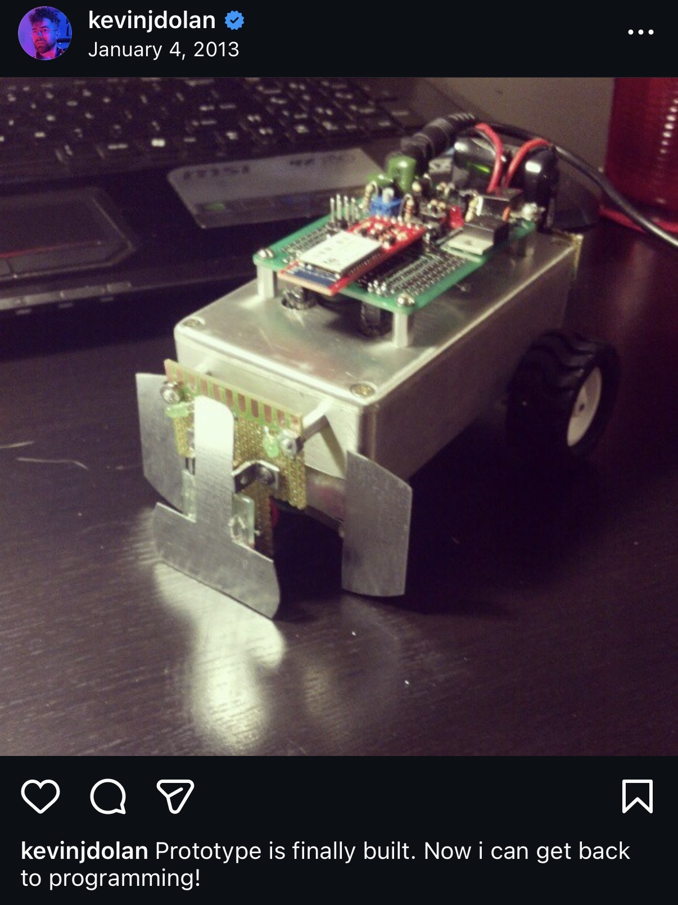

# Robogram

In 2013, I attempted to build a programmable robot toy to help teach kids how to code. The idea: a small two-wheeled robot that a child could control by writing simple programs on a connected computer, giving immediate physical feedback as their code runs.



## Overview

The robot communicates with a host computer over Bluetooth using a simple bracket-delimited message protocol. The host sends commands (e.g. move at a given speed), the robot executes them and responds with sensor state. The goal was to keep the protocol simple enough that a beginner could understand and extend it.

**Hardware features:**
- Two DC motors with wheel encoders and PID speed control
- Front, left, and right bump sensors
- IR proximity sensor
- LED "eyes" with PWM brightness control
- Bluetooth serial link (288000 baud)
- AVR microcontroller running at 14.7456 MHz

## Repository Structure

```
eagle/      — PCB schematic and component library (EAGLE)
embedded/   — AVR-GCC firmware (C)
python/     — Host-side test script (Python 2, Bluetooth serial)
```

## Message Protocol

Messages are bracket-delimited ASCII strings sent over Bluetooth.

| Command | Format | Response | Description |
|---------|--------|----------|-------------|
| Get state | `[GS]` | `[FLRIIII]` | Bumper events (F/L/R) + IR value (hex) |
| Move | `[MVLLMRRS]` | `[OK]` | Left speed + direction, right speed + direction |

Bumper event characters: `L` = low, `H` = high, `F` = falling edge, `R` = rising edge.

## Building and Flashing

From the `embedded/` directory:

```sh
mkdir build
cd build
cmake -DCMAKE_TOOLCHAIN_FILE=../avr-gcc-toolchain.cmake ../
```

Then to build and upload:

```sh
cd build
make upload_robogram
```

## Status

This was a prototype/exploration. The movement command is stubbed out in firmware and the Python script is a latency benchmark over Bluetooth rather than a finished interface. The project was shelved before reaching a child-facing programming environment.
